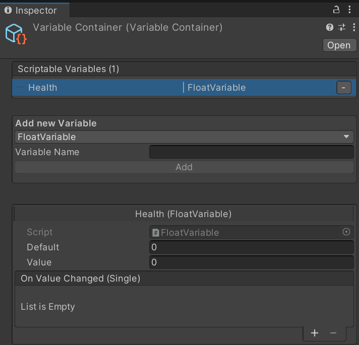

# Scriptable Variable Objects
 
## Installation
You can install this as a Package through Unity's PackageManager.
(Optionally) Use my Git Package Updater to install (& update) git packages: https://github.com/Toorah/com.toorah-games.gitupdater
 
## Generator
Included comes an Editor Window to quickly generate new *classes* for your own *types*.
It can be accessed via:
**`Window/Scriptable Variables/Generator`**

 
- To create new *classes* enter a **Name** for the *class* and the **Type**.
- The **Name** will be used for the class and file name, whereas the **Type** is the actual *C# type*.
- The toggle next to **Type**** causes the **Name** to be used as the **Type** in lowecase; eg. Float -> float. Disabling the toggle allows to enter a custom type.
- The **Path** is where generated classes will be saved. Use the **Browse** button to select a folder within **Assets/**
- **Generate** will create 2 scripts in **Path**. One for the **Type** entered, and a specific **List\<T>** type

At the bottom of the Editor Window are 2 preview windows, to check the script file contents before they are generated.

## How to Use
To create Scriptbale Object Variables, go to:
**`Assets/Create/Scriptable Variables/*`**
Select the desired variable from either **`Single/`** or **`List/`**.

You can also create Container Objects that are useful for Grouping variables under a single Asset.
To create a Container Object, select:
**`Assets/Create/Scriptable Variables/Container`**

In the **Inspector** you have the following features:
- At the top is the List of Variables that are created under this Asset
- **`Add new Variable`** allows to create a new Variable with the Type selected in the DropDown and the name of **`Variable Name`**. Once the type and name is set, click on **`Add`** to create a new Variable, it will be listed at the top.
- Selecting a Variable in the List, will display its inspector directly (alternatively, select the asset for the corresponding variable in your project window, under the container asset)

## Examples
> Inspectors for different Scriptable Object Variables 
Float Variable
 
Gradient Variable
 
GameObject List Variable
 

## Todo
- [ ] Reference Class: Can be used with or without a variable object, to avoid having to create variable objects for everything, while allowing to use them anyway without changing the code
- [ ] Property Drawers for Scriptable Variables
- [ ] Better Generator Window
- [x] Containers: Group Variables
