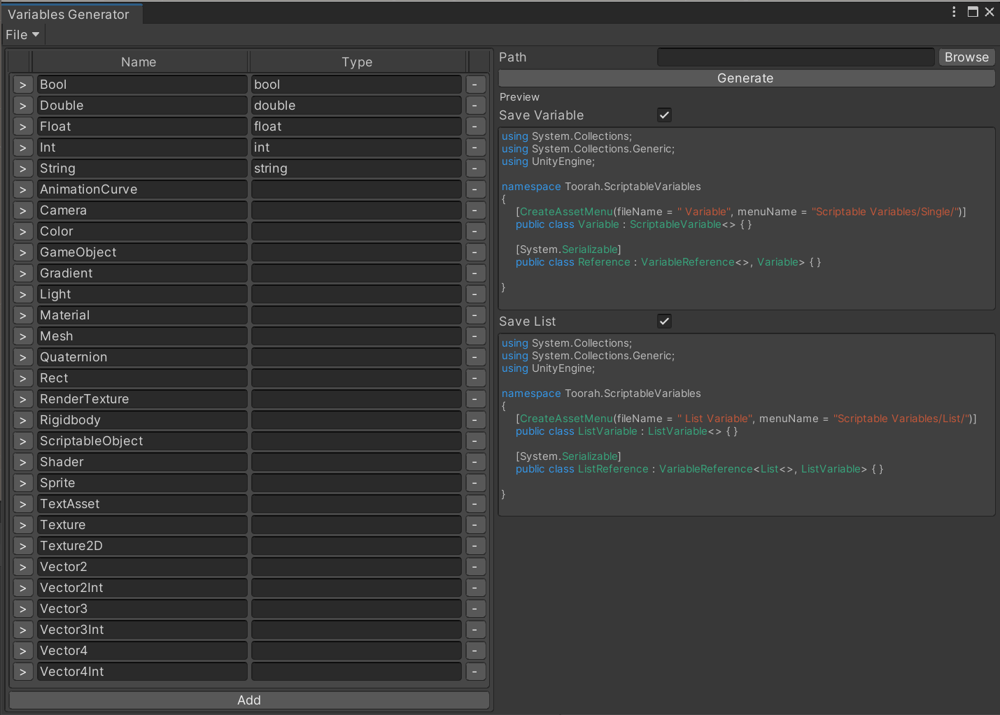
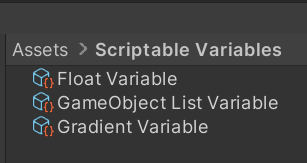
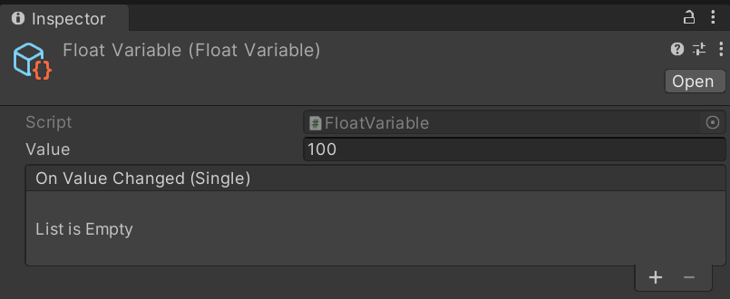
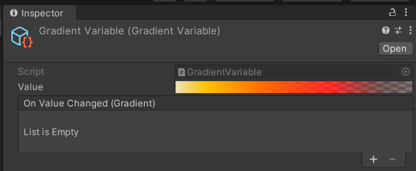
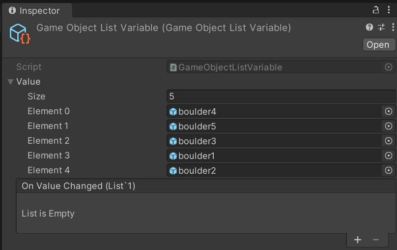

# Scriptable Variable Objects
 
## Generator
Included comes an Editor Window to quickly generate new *classes* for your own *types*.
It can be accessed via:
> \> ***Window/Scriptable Variables/Generator***

 
- To create new *classes* enter a **Name** for the *class* and the **Type**.
- The **Name** will be used for the class and file name, whereas the **Type** is the actual *C# type*.
- The toggle next to **Type**** causes the **Name** to be used as the **Type** in lowecase; eg. Float -> float. Disabling the toggle allows to enter a custom type.
- The **Path** is where generated classes will be saved. Use the **Browse** button to select a folder within **Assets/**
- **Generate** will create 2 scripts in **Path**. One for the **Type** entered, and a specific **List\<T>** type

At the bottom of the Editor Window are 2 preview windows, to check the script file contents before they are generated.

## Examples
> Scriptable Objects in **Assets/** 
 

> Inspectors for different Scriptable Object Variables 
 
 
 

## Todo
- Reference Class: Can be used with or without a variable object, to avoid having to create variable objects for everything, while allowing to use them anyway without changing the code
- Property Drawers for Scriptable Variables
- Better Generator Window
- Containers: Group Variables
